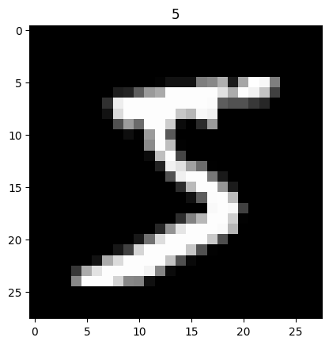
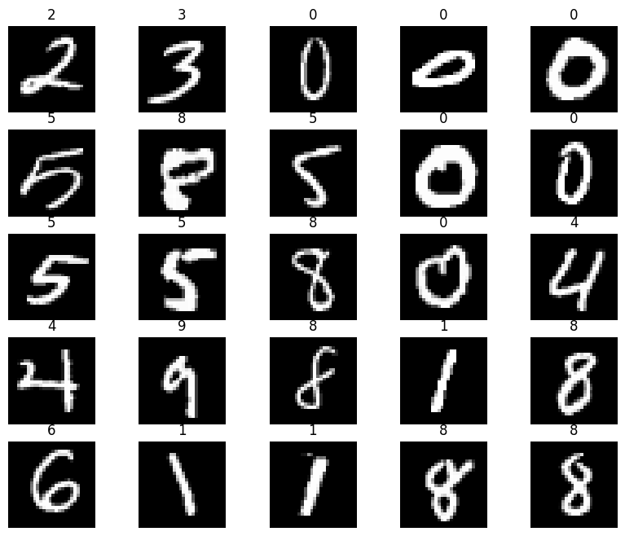
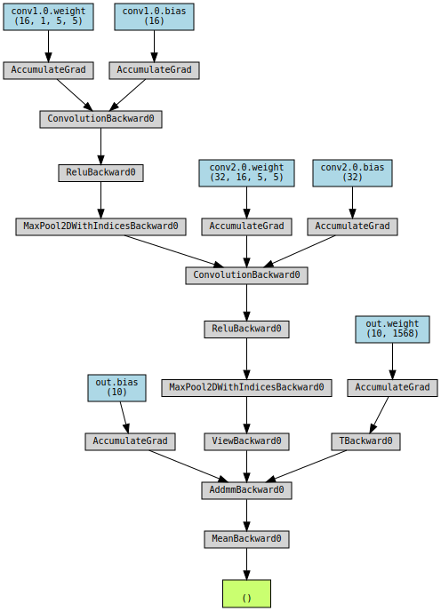

```python
import torch
```


```python
device = torch.device('cuda' if torch.cuda.is_available() else 'cpu')
device
```


    device(type='cpu')


```python
from torchvision import datasets
from torchvision.transforms import ToTensor
```


```python
train_data = datasets.MNIST(
    root = 'data',
    train = True,
    transform = ToTensor(),
    download = True,
)
test_data = datasets.MNIST(
    root = 'data',
    train = False,
    transform = ToTensor()
)
```

    Downloading http://yann.lecun.com/exdb/mnist/train-images-idx3-ubyte.gz
    Downloading http://yann.lecun.com/exdb/mnist/train-images-idx3-ubyte.gz to data/MNIST/raw/train-images-idx3-ubyte.gz


    100%|██████████| 9912422/9912422 [00:00<00:00, 71786227.03it/s]


    Extracting data/MNIST/raw/train-images-idx3-ubyte.gz to data/MNIST/raw
    
    Downloading http://yann.lecun.com/exdb/mnist/train-labels-idx1-ubyte.gz
    Downloading http://yann.lecun.com/exdb/mnist/train-labels-idx1-ubyte.gz to data/MNIST/raw/train-labels-idx1-ubyte.gz


    100%|██████████| 28881/28881 [00:00<00:00, 18284633.03it/s]

    Extracting data/MNIST/raw/train-labels-idx1-ubyte.gz to data/MNIST/raw
    
    Downloading http://yann.lecun.com/exdb/mnist/t10k-images-idx3-ubyte.gz
    Downloading http://yann.lecun.com/exdb/mnist/t10k-images-idx3-ubyte.gz to data/MNIST/raw/t10k-images-idx3-ubyte.gz


    
    100%|██████████| 1648877/1648877 [00:00<00:00, 19292265.67it/s]


    Extracting data/MNIST/raw/t10k-images-idx3-ubyte.gz to data/MNIST/raw
    
    Downloading http://yann.lecun.com/exdb/mnist/t10k-labels-idx1-ubyte.gz
    Downloading http://yann.lecun.com/exdb/mnist/t10k-labels-idx1-ubyte.gz to data/MNIST/raw/t10k-labels-idx1-ubyte.gz


    100%|██████████| 4542/4542 [00:00<00:00, 15526103.32it/s]

    Extracting data/MNIST/raw/t10k-labels-idx1-ubyte.gz to data/MNIST/raw
    


    


```python
print(train_data)
```

    Dataset MNIST
        Number of datapoints: 60000
        Root location: data
        Split: Train
        StandardTransform
    Transform: ToTensor()


```python
print(test_data)
```

    Dataset MNIST
        Number of datapoints: 10000
        Root location: data
        Split: Test
        StandardTransform
    Transform: ToTensor()


```python
print(train_data.data.size())
```

    torch.Size([60000, 28, 28])


```python
print(train_data.targets.size())
```

    torch.Size([60000])


```python
import matplotlib.pyplot as plt
plt.imshow(train_data.data[0], cmap='gray')
plt.title('%i' % train_data.targets[0])
plt.show()
```


    

    


```python
figure = plt.figure(figsize=(10, 8))
cols, rows = 5, 5
for i in range(1, cols * rows + 1):
    sample_idx = torch.randint(len(train_data), size=(1,)).item()
    img, label = train_data[sample_idx]
    figure.add_subplot(rows, cols, i)
    plt.title(label)
    plt.axis("off")
    plt.imshow(img.squeeze(), cmap="gray")
plt.show()
```


    

    


```python
from torch.utils.data import DataLoader
loaders = {
    'train' : torch.utils.data.DataLoader(train_data,
                                          batch_size=100,
                                          shuffle=True,
                                          num_workers=1),

    'test'  : torch.utils.data.DataLoader(test_data,
                                          batch_size=100,
                                          shuffle=True,
                                          num_workers=1),
}
loaders
```


    {'train': <torch.utils.data.dataloader.DataLoader at 0x7c0dc7b3f040>,
     'test': <torch.utils.data.dataloader.DataLoader at 0x7c0dc7b3f1c0>}


```python
import torch.nn as nn
```


```python
class CNN(nn.Module):
    def __init__(self):
        super(CNN, self).__init__()
        self.conv1 = nn.Sequential(
            nn.Conv2d(
                in_channels=1,
                out_channels=16,
                kernel_size=5,
                stride=1,
                padding=2,
            ),
            nn.ReLU(),
            nn.MaxPool2d(kernel_size=2),
        )
        self.conv2 = nn.Sequential(
            nn.Conv2d(16, 32, 5, 1, 2),
            nn.ReLU(),
            nn.MaxPool2d(2),
        )
        # fully connected layer, output 10 classes
        self.out = nn.Linear(32 * 7 * 7, 10)
    def forward(self, x):
        x = self.conv1(x)
        x = self.conv2(x)
        # flatten the output of conv2 to (batch_size, 32 * 7 * 7)
        x = x.view(x.size(0), -1)
        output = self.out(x)
        return output, x    # return x for visualization
```


```python
cnn = CNN()
print(cnn)
```

    CNN(
      (conv1): Sequential(
        (0): Conv2d(1, 16, kernel_size=(5, 5), stride=(1, 1), padding=(2, 2))
        (1): ReLU()
        (2): MaxPool2d(kernel_size=2, stride=2, padding=0, dilation=1, ceil_mode=False)
      )
      (conv2): Sequential(
        (0): Conv2d(16, 32, kernel_size=(5, 5), stride=(1, 1), padding=(2, 2))
        (1): ReLU()
        (2): MaxPool2d(kernel_size=2, stride=2, padding=0, dilation=1, ceil_mode=False)
      )
      (out): Linear(in_features=1568, out_features=10, bias=True)
    )


```python
loss_func = nn.CrossEntropyLoss()
loss_func
```


    CrossEntropyLoss()


```python
from torch import optim
```


```python
optimizer = optim.Adam(cnn.parameters(), lr = 0.01)
optimizer
```


    Adam (
    Parameter Group 0
        amsgrad: False
        betas: (0.9, 0.999)
        capturable: False
        differentiable: False
        eps: 1e-08
        foreach: None
        fused: None
        lr: 0.01
        maximize: False
        weight_decay: 0
    )


```python
from torch.autograd import Variable
```


```python
num_epochs = 10
```


```python
def train(num_epochs, cnn, loaders):

    cnn.train()

    # Train the model
    total_step = len(loaders['train'])

    for epoch in range(num_epochs):
        for i, (images, labels) in enumerate(loaders['train']):

            # gives batch data, normalize x when iterate train_loader
            b_x = Variable(images)   # batch x
            b_y = Variable(labels)   # batch y
            output = cnn(b_x)[0]
            loss = loss_func(output, b_y)

            # clear gradients for this training step
            optimizer.zero_grad()

            # backpropagation, compute gradients
            loss.backward()
            # apply gradients
            optimizer.step()

            if (i+1) % 100 == 0:
               print('Epoch [{}/{}], Step [{}/{}], Loss: {:.4f}'.format(epoch + 1, num_epochs, i + 1, total_step, loss.item()))
               pass
        pass
    pass
train(num_epochs, cnn, loaders)
```

    Epoch [1/10], Step [100/600], Loss: 0.1768
    Epoch [1/10], Step [200/600], Loss: 0.0684
    Epoch [1/10], Step [300/600], Loss: 0.0565
    Epoch [1/10], Step [400/600], Loss: 0.0900
    Epoch [1/10], Step [500/600], Loss: 0.0726
    Epoch [1/10], Step [600/600], Loss: 0.0183
    Epoch [2/10], Step [100/600], Loss: 0.0625
    Epoch [2/10], Step [200/600], Loss: 0.1208
    Epoch [2/10], Step [300/600], Loss: 0.0448
    Epoch [2/10], Step [400/600], Loss: 0.0216
    Epoch [2/10], Step [500/600], Loss: 0.0088
    Epoch [2/10], Step [600/600], Loss: 0.0321
    Epoch [3/10], Step [100/600], Loss: 0.0513
    Epoch [3/10], Step [200/600], Loss: 0.0225
    Epoch [3/10], Step [300/600], Loss: 0.0168
    Epoch [3/10], Step [400/600], Loss: 0.0836
    Epoch [3/10], Step [500/600], Loss: 0.0249
    Epoch [3/10], Step [600/600], Loss: 0.0612
    Epoch [4/10], Step [100/600], Loss: 0.1330
    Epoch [4/10], Step [200/600], Loss: 0.1414
    Epoch [4/10], Step [300/600], Loss: 0.0472
    Epoch [4/10], Step [400/600], Loss: 0.0686
    Epoch [4/10], Step [500/600], Loss: 0.0351
    Epoch [4/10], Step [600/600], Loss: 0.0393
    Epoch [5/10], Step [100/600], Loss: 0.0633
    Epoch [5/10], Step [200/600], Loss: 0.0411
    Epoch [5/10], Step [300/600], Loss: 0.0393
    Epoch [5/10], Step [400/600], Loss: 0.0587
    Epoch [5/10], Step [500/600], Loss: 0.0374
    Epoch [5/10], Step [600/600], Loss: 0.1076
    Epoch [6/10], Step [100/600], Loss: 0.1192
    Epoch [6/10], Step [200/600], Loss: 0.1589
    Epoch [6/10], Step [300/600], Loss: 0.0277
    Epoch [6/10], Step [400/600], Loss: 0.0106
    Epoch [6/10], Step [500/600], Loss: 0.0118
    Epoch [6/10], Step [600/600], Loss: 0.0463
    Epoch [7/10], Step [100/600], Loss: 0.0083
    Epoch [7/10], Step [200/600], Loss: 0.0905
    Epoch [7/10], Step [300/600], Loss: 0.0628
    Epoch [7/10], Step [400/600], Loss: 0.0167
    Epoch [7/10], Step [500/600], Loss: 0.0109
    Epoch [7/10], Step [600/600], Loss: 0.0269
    Epoch [8/10], Step [100/600], Loss: 0.0080
    Epoch [8/10], Step [200/600], Loss: 0.0333
    Epoch [8/10], Step [300/600], Loss: 0.0213
    Epoch [8/10], Step [400/600], Loss: 0.0526
    Epoch [8/10], Step [500/600], Loss: 0.0393
    Epoch [8/10], Step [600/600], Loss: 0.2313
    Epoch [9/10], Step [100/600], Loss: 0.0186
    Epoch [9/10], Step [200/600], Loss: 0.0023
    Epoch [9/10], Step [300/600], Loss: 0.0029
    Epoch [9/10], Step [400/600], Loss: 0.0363
    Epoch [9/10], Step [500/600], Loss: 0.1102
    Epoch [9/10], Step [600/600], Loss: 0.0080
    Epoch [10/10], Step [100/600], Loss: 0.0685
    Epoch [10/10], Step [200/600], Loss: 0.0726
    Epoch [10/10], Step [300/600], Loss: 0.0103
    Epoch [10/10], Step [400/600], Loss: 0.0316
    Epoch [10/10], Step [500/600], Loss: 0.0135
    Epoch [10/10], Step [600/600], Loss: 0.0454


```python
def test():
    # Test the model
    cnn.eval()
    with torch.no_grad():
        correct = 0
        total = 0
        for images, labels in loaders['test']:
            test_output, last_layer = cnn(images)
            pred_y = torch.max(test_output, 1)[1].data.squeeze()
            accuracy = (pred_y == labels).sum().item() / float(labels.size(0))
            pass
        print('Test Accuracy of the model on the 10000 test images: %.2f' % accuracy)

    pass
test()
```

    Test Accuracy of the model on the 10000 test images: 0.99


```python
sample = next(iter(loaders['test']))
imgs, lbls = sample
```


```python
actual_number = lbls[:10].numpy()
actual_number
```


    array([0, 4, 8, 2, 0, 8, 0, 6, 6, 7])


```python
test_output, last_layer = cnn(imgs[:10])
pred_y = torch.max(test_output, 1)[1].data.numpy().squeeze()
print(f'Prediction number: {pred_y}')
print(f'Actual number: {actual_number}')
```

    Prediction number: [0 4 8 2 0 4 0 6 6 7]
    Actual number: [0 4 8 2 0 8 0 6 6 7]


```python
!sudo apt-get install graphviz
```

    Reading package lists... Done
    Building dependency tree... Done
    Reading state information... Done
    graphviz is already the newest version (2.42.2-6).
    0 upgraded, 0 newly installed, 0 to remove and 18 not upgraded.


```python
!pip install torchviz
```

    Collecting torchviz
      Downloading torchviz-0.0.2.tar.gz (4.9 kB)
      Preparing metadata (setup.py) ... [?25l[?25hdone
    Requirement already satisfied: torch in /usr/local/lib/python3.10/dist-packages (from torchviz) (2.0.1+cu118)
    Requirement already satisfied: graphviz in /usr/local/lib/python3.10/dist-packages (from torchviz) (0.20.1)
    Requirement already satisfied: filelock in /usr/local/lib/python3.10/dist-packages (from torch->torchviz) (3.12.4)
    Requirement already satisfied: typing-extensions in /usr/local/lib/python3.10/dist-packages (from torch->torchviz) (4.5.0)
    Requirement already satisfied: sympy in /usr/local/lib/python3.10/dist-packages (from torch->torchviz) (1.12)
    Requirement already satisfied: networkx in /usr/local/lib/python3.10/dist-packages (from torch->torchviz) (3.1)
    Requirement already satisfied: jinja2 in /usr/local/lib/python3.10/dist-packages (from torch->torchviz) (3.1.2)
    Requirement already satisfied: triton==2.0.0 in /usr/local/lib/python3.10/dist-packages (from torch->torchviz) (2.0.0)
    Requirement already satisfied: cmake in /usr/local/lib/python3.10/dist-packages (from triton==2.0.0->torch->torchviz) (3.27.6)
    Requirement already satisfied: lit in /usr/local/lib/python3.10/dist-packages (from triton==2.0.0->torch->torchviz) (17.0.2)
    Requirement already satisfied: MarkupSafe>=2.0 in /usr/local/lib/python3.10/dist-packages (from jinja2->torch->torchviz) (2.1.3)
    Requirement already satisfied: mpmath>=0.19 in /usr/local/lib/python3.10/dist-packages (from sympy->torch->torchviz) (1.3.0)
    Building wheels for collected packages: torchviz
      Building wheel for torchviz (setup.py) ... [?25l[?25hdone
      Created wheel for torchviz: filename=torchviz-0.0.2-py3-none-any.whl size=4130 sha256=3a3e2a5b0e8f29254348dfaa16d7761aab42271b15734864b3b766c904bc305c
      Stored in directory: /root/.cache/pip/wheels/4c/97/88/a02973217949e0db0c9f4346d154085f4725f99c4f15a87094
    Successfully built torchviz
    Installing collected packages: torchviz
    Successfully installed torchviz-0.0.2


```python
from torchviz import make_dot
make_dot(test_output.mean(), params=dict(cnn.named_parameters()))
```


    

    


```python

```
